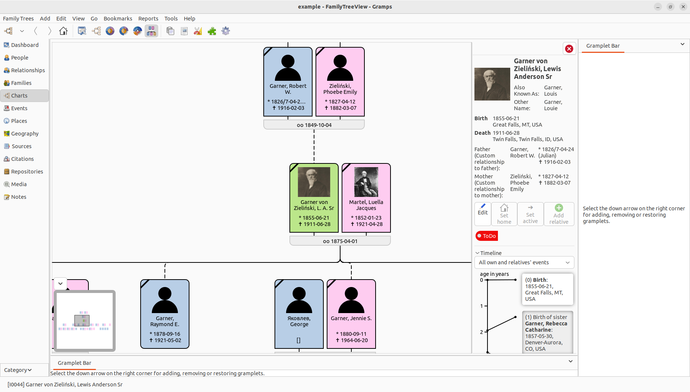

# FamilyTreeView 

FamilyTreeView is a third-party addon for Gramps. It provides a navigable tree representation of ancestors, descendants and other related persons.

Note that this addon is currently under development and should not be considered stable. It has not been thoroughly tested and interfaces are likely to change. **Backup your data before using this addon.**

Features:
- Tree visualization of relatives of the active person
- Info box pop-up with basic information on a person / family
- Side panel with detailed information on a person / families including a timeline
- Name abbreviation algorithm to fit long names into the fix-sized boxes (`AbbreviatedNameDisplay`)
- Badges for customizable display of interesting / important information (new / custom badges can be registered)
- Intuitive zoom centered at mouse pointer position
- Mini map for orientation

Screenshot:

This repository includes the following addons, which are registered individually:
- FamilyTreeView, the main addon of this repository
- FamilyTreeView Example Badges, registers example badges which can be activated in FamilyTreeView's configuration window
- Children Quick View, quick view/report listing children, used as a callback example for clicking on badges

## Installation
FamilyTreeView uses GooCanvas to draw the tree. If you are using Gramps' Graph View, all requirements are satisfied already. (In contrast to Graph View, FamilyTreeView doesn't require Graphviz.)

To add FamilyTreeView to Gramps, clone or download this repository to your Gramps user directory, into the sub-directory `gramps52/plugins`, e.g. `~/.gramps/gramps52/FamilyTreeView`. Usually the Gramps user directory is located here:
  - Linux / MacoOS (built) / other POSIX: `~/.gramps` (e.g. `/home/<username>/.gramps`)
  - Windows: `%AppData%\gramps` (e.g. `C:\Users\<username>\AppData\Roaming\gramps`)
  - MacOS Application Package: `/Users/<username>/Library/Application Support/gramps`

## TODOs, ideas & known issues
- tree:
  - move siblings closer together if positioning of their descendants allow it
  - reduce large generation gaps for generation ~7+ if they are not needed for connecting lines
  - expanders (expand more ancestors / descendants / relatives of a specific person / family)
    - expand ancestor of a person (which are not visible due to selected maximum generation)
    - expand descendants of a family (which are not visible due to selected minimum generation)
    - expand other families / spouses of a person
    - expand siblings of a person
    - expand parents and siblings of spouse of active person
    - expand other parents of active person or ancestor
    - maybe more
- context menus (edit, add new person as parent, spouse, child etc.)
- implement "add relative" button functionality
- panel:
  - more info (persons and families: media overview; persons: e.g. families, spouses and children)
  - context menu and go to buttons (opt.) next to names in the panel (incl. timeline)
  - context menu on events in timeline (e.g. edit event)
  - badges in info box and panel (separately (de)activatable in config)
  - ticks for negative time (e.g. birth of spouses where marriage is 0)
  - if birth is uncertain, no range
  - option to hide large gaps in timeline (x years removed)
  - better ui design of panel
- adaptive canvas size based on content and padding based on zoom and ScrolledWindow's size
- more customization options
- hight of info box should adjust to content
- find a good way to include a search bar (e.g. SearchWidget from graph view), add zoom buttons
- better solution for positioning SVGs on canvas
- make mini map clickable to jump to a different location
- right-to-left direction (similar to pedigree view) as an alternative to top-to-bottom
- better info for marriage (and likely other events) in timeline
- overlapping lines from families to children appear thicker when zoomed out
- badge priority / not too many badges
- shadow on hover of person and family boxes
- performance test for large trees and possible improvement
- tests for AbbreviatedNameDisplay
- translation
- color coding
- alternative centering of single child
- generalize ui code to support different styles / themes for different visualizations of persons and families
- all the other TODOs in the code
